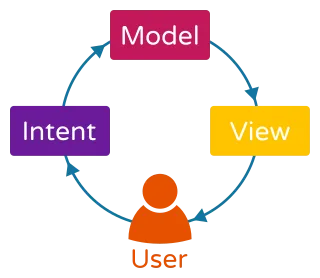

## AndroidMviFrame


AndroidMviFrame 是一个Android简单易用的项目框架

文档下面会对框架中所使用的一些核心技术进行阐述。该框架作为技术积累的产物，会一直更新维护，如果有技术方面的谈论或者框架中的错误点，可以在 **GitHub** 上提 **Issues**，我会及时进行回应并进行修复。

希望这个框架项目能给大家带来帮助，喜欢可以Start🌟。


#### 模块

##### app：壳工程

是依赖所有组件的壳,该工程中只要MainActivity相关信息。

##### libs/lib_base：

项目的基础公共模块，存放着各种基类封装、对远程库的依赖、以及工具类、三方库封装，该组件是和项目业务无关的，和项目业务相关的公共部分需要放在 lib_common 中。

##### libs/lib_common：

项目的业务公共模块，这里面存放着项目里各个业务组件的公共部分。


项目使用技术栈为：

#### 组件化

组件化是指解耦复杂系统时，将多个功能模板拆分、重组的过程。在Android工程表现上就是把app按照其业务的不同，划分为不同的Module。

组件化架构的目的就是让每个业务模块变得相对独立，各个组件在组件模式下可以独立开发调试，集成模式下又可以集成到“app壳工程”中，从而得到一个具有完整功能的APP。

配置如下 gradle.properties

```
当设置成true时，单个module可以运行
singleModule=false
```

当你生成一个新的Module的时候，需要做以下配置，这样才可以保证你的Module当组件运行的时候，万无一失。

第一步：

`

```
if (!singleModule.toBoolean()) {
    apply plugin: 'com.android.library'
} else {
    apply plugin: 'com.android.application'
}
apply from: '../dependencies.gradle'

android {
    sourceSets {
        main {
            if (!singleModule.toBoolean()) {
                //如果是library，则编译manifest下AndroidManifest.xml
                manifest.srcFile 'src/main/manifest/AndroidManifest.xml'
            } else {
                //如果是application，则编译主目录下AndroidManifest.xml
                manifest.srcFile 'src/main/AndroidManifest.xml'
            }
        }
    }
    defaultConfig {
        if (singleModule.toBoolean()) {
            applicationId rootProject.applicationId
        }
        kapt {
            arguments {
                arg("AROUTER_MODULE_NAME", project.getName())
            }
        }

        javaCompileOptions {
            annotationProcessorOptions {
                arguments = [AROUTER_MODULE_NAME: project.getName()]
            }
        }

        ndk {
            abiFilters rootProject.ext.abiFilters
        }
    }


    buildTypes {
        debug {}
        stagdebug {
            consumerProguardFiles 'proguard-rules.pro'
        }
        stagrelease {
            consumerProguardFiles 'proguard-rules.pro'
        }
        release {
            consumerProguardFiles 'proguard-rules.pro'
        }
    }
}

dependencies {
    implementation fileTree(dir: "libs", include: ["*.jar", '*.aar'])
    implementation project(':libs:lib_common')

    annotationProcessor 'com.alibaba:arouter-compiler:1.5.2'
}
```

`

复制以上内容，覆盖module下的build.gradle文件

第二步：

在module的main文件夹下边创建manifest文件夹，在此文件夹下创建AndroidManifest.xml

至此组件化就配置完成了。


#### MVI



- **Model层**: 它是一个 ViewModel，其中执行不同的同步或异步任务。它接受 UserIntents 作为输入并产生一个或多个连续状态作为输出。

- **View层**: 视图只是处理它从 ViewModel 接收到的不可变状态以更新 UI。它还允许将用户操作传输到 ViewModel 以完成定义的任务。

- **Intent层**: 表示用户与 UI 交互时的意图。例如，单击按钮刷新数据列表将被建模为 Intent。为了避免与 Android 框架 Intent 混淆，我们将在本文的其余部分将其称为 UserIntent。。

  

关于MVI base层的封装这里不在过多叙述，感兴趣的可以直接clone项目研究，这里我们就是说如何使用。

这里我们以module_home为例：

第一步：在项目里添加service文件夹，创建HomeService接口类

``

```
interface HomeService {

    @POST(ComServerApi.API_BANNER)
    suspend fun getBanner(@Body requestBody: RequestBody): BaseData<List<WanBean>>

    @GET(ComServerApi.API_COIN_RANK)
    suspend fun getRankList(): BaseData<RankBean>
}
```


第二步：封装Home接口网络层

``

```
class HomeRepo : BaseRepository() {
    private val service = RetrofitUtil.getService(HomeService::class.java)

    suspend fun requestWanData(drinkId: String): BaseData<List<WanBean>> {
        val requestBody = jsonRequest()
            .p("drinkId", drinkId)
            .body()
        return executeRequest { service.getBanner(requestBody) }
    }

    suspend fun requestRankData(): BaseData<RankBean> {
        return executeRequest { service.getRankList() }
    }
}
```

第三步：添加HomeMviState状态

``

```
data class MviState(val bannerUiState: BannerUiState, val detailUiState: DetailUiState?) : IUiState

sealed class BannerUiState {
    object INIT : BannerUiState()
    data class SUCCESS(val models: List<WanBean>) : BannerUiState()
}

data class MviSingleUiState(val message: String) : ISingleUiState
sealed class DetailUiState {
    object INIT : DetailUiState()
    data class SUCCESS(val detail: RankBean) : DetailUiState()
}
```

第四步：封装Model调用网络接口

``

```
class HomeMviModel : BaseMviModel<MviState, MviSingleUiState>() {
    private val mLoginRepo = HomeRepo()

    fun initData(bundle: Bundle?) {

    }

    override fun initUiState(): MviState {
        return MviState(BannerUiState.INIT, DetailUiState.INIT)
    }

    /**
     * 获取banner信息
     */
    fun loadBannerData() {
        requestDataWithFlow(
            showLoading = true,
            request = { mLoginRepo.requestWanData("12345") },
            successCallback = { data ->
                sendUiState {
                    copy(bannerUiState = BannerUiState.SUCCESS(data))
                }
            },
            failCallback = {}
        )
    }

    //请求List数据
    fun loadDetailData() {
        requestDataWithFlow(
            showLoading = false,
            request = { mLoginRepo.requestRankData() },
            successCallback = { data ->
                sendUiState {
                    copy(detailUiState = DetailUiState.SUCCESS(data))
                }
            },
            failCallback = {}
        )
    }

}
```

第五步：Activity/Fragment初始化mViewModel

`

```
private val mViewModel: HomeMviModel by viewModels()

调用接口
mViewModel.loadDetailData()

获取后台数据
mViewModel.uiStateFlow.flowWithLifecycle2(
            this, Lifecycle.State.STARTED,
            prop1 = MviState::detailUiState
        ) { state ->
            when (state) {
                is DetailUiState.INIT -> {}
                is DetailUiState.SUCCESS -> {
                    val list = state.detail.datas
                    mBinding.tvShowUser1.text = "显示Banner数据2：${Gson().toJson(list)}"
                }
            }
        }
```

`

#### 项目使用的三方库

- [Kotlin](https://github.com/JetBrains/kotlin)
- [Kotlin-Coroutines-Flow](https://github.com/JetBrains/kotlin)
- [Lifecycle](https://developer.android.com/jetpack/androidx/releases/lifecycle)
- [ViewBinding](https://developer.android.com/topic/libraries/view-binding)
- [OkHttp](https://github.com/square/okhttp)：okhttp网络请求
- [Retrofit](https://github.com/square/retrofit)：封装okhttp网络请求
- [MMKV](https://github.com/Tencent/MMKV)：腾讯基于 **mmap** 内存映射的 **key-value** 本地存储组件
- [Coil](https://github.com/coil-kt/coil)：一个 Android 图片加载库，通过 Kotlin 协程的方式加载图片
- [ARoute](https://github.com/alibaba/ARouter)：阿里用于帮助 **Android App** 进行组件化改造的框架 —— 支持模块间的路由、通信、解耦
- [BaseRecyclerViewAdapterHelper](https://github.com/CymChad/BaseRecyclerViewAdapterHelper)：一个强大并且灵活的 **RecyclerViewAdapter**
- [EventBus](https://github.com/greenrobot/EventBus)：适用于 **Android** 和 **Java** 的发布/订阅事件总线
- [AndroidAutoSize](https://github.com/JessYanCoding/AndroidAutoSize)：今日头条屏幕适配方案终极版
- [smart刷新框架](https://github.com/scwang90/SmartRefreshLayout)：Android智能下拉刷新框架-SmartRefreshLayout
- [规避 64K 限制](https://developer.android.google.cn/studio/build/multidex?hl=zh-cn)：规避 64K 限制
- [immersionbar](https://github.com/gyf-dev/ImmersionBar)：沉浸式实现
- [AgentWeb](https://github.com/Justson/AgentWeb)：AgentWeb 是一个基于的 Android WebView

##### Kotlin 协程

关于kotlin协程，具体可以看一下几片文章

- [kotlin语法进阶 - 协程（一）协程基础](https://blog.csdn.net/weixin_43864176/article/details/126234790)
- [万字长文 - Kotlin 协程进阶](https://juejin.cn/post/6950616789390721037)

关于Flow，具体可以看一下几片文章

- [Flow官网](https://developer.android.com/reference/java/util/concurrent/Flow)
- [Flow原理解析](https://www.jianshu.com/p/5438f196f78a)
- [Flow 与Live Data对比](https://www.jianshu.com/p/82047c8e735c)
- [Kotlin Coroutines Flow 系列(1-5):](https://juejin.im/post/6844904057530908679) 

##### Lifecycle

``

```
class ActivityLifecycleCallbacksImpl : Application.ActivityLifecycleCallbacks {

    private val TAG = "ActivityLifecycle"
    private var mCount: Int = 0

    override fun onActivityCreated(activity: Activity, bundle: Bundle?) {
        ActivityStackManager.addActivityToStack(activity)
        Log.d(TAG, "${activity.javaClass.simpleName} --> onActivityCreated")
    }

    override fun onActivityStarted(activity: Activity) {
        Log.d(TAG, "${activity.javaClass.simpleName} --> onActivityStarted")

        mCount++
        if (mCount == 1 && BaseConstants.isBackground) {
            //说明应用重新进入了前台
            BaseConstants.isBackground = false
        }
    }

    override fun onActivityResumed(activity: Activity) {
        Log.d(TAG, "${activity.javaClass.simpleName} --> onActivityResumed")
    }

    override fun onActivityPaused(activity: Activity) {
        Log.d(TAG, "${activity.javaClass.simpleName} --> onActivityPaused")
    }

    override fun onActivityStopped(activity: Activity) {
        Log.d(TAG, "${activity.javaClass.simpleName} --> onActivityStopped")

        mCount--
        if (mCount <= 0 && !BaseConstants.isBackground ) {
            //说明应用进入了后台
            BaseConstants.isBackground = true
            Toast.makeText(activity, "奇宝进入后台", Toast.LENGTH_LONG).show()
        }
    }

    override fun onActivitySaveInstanceState(activity: Activity, outState: Bundle) {
        Log.d(TAG, "${activity.javaClass.simpleName} --> onActivitySaveInstanceState")
    }

    override fun onActivityDestroyed(activity: Activity) {
        ActivityStackManager.popActivityToStack(activity)
        Log.d(TAG, "${activity.javaClass.simpleName} --> onActivityDestroyed")
    }
```

在Appliction的onCreate()初始化监听

``

```
// 全局监听 Activity 生命周期
registerActivityLifecycleCallbacks(ActivityLifecycleCallbacksImpl())
```

官方文档:[https://developer.android.com/jetpack/androidx/releases/lifecycle](https://developer.android.com/jetpack/androidx/releases/lifecycle)


##### ViewBinding

通过视图绑定功能，可以更轻松地编写可与视图交互的代码。用于代替findViewById

#####  在build.gradle里边的  android {}

``

```
buildFeatures {
    viewBinding true
}
```

**ViewBinding** 在项目中的使用

`HomeActivity : BaseMviActivity<ActivityHomeBinding>`

```
override fun getViewBing(layoutInflater: LayoutInflater): ActivityHomeBinding {
    return ActivityHomeBinding.inflate(layoutInflater)
}
```

官方文档: [https://developer.android.com/topic/libraries/view-binding](https://developer.android.com/topic/libraries/view-binding)  

##### MMKV

MMKV 是基于 mmap 内存映射的 key-value 组件，底层序列化/反序列化使用 protobuf 实现，性能高，稳定性强。

项目中已封装

``

```
object MMKVSpUtils {

    /**
     * 初始化
     */
    fun initMMKV(context: Context): String? = MMKV.initialize(context)

    /**
     * 保存数据（简化）
     * 根据value类型自动匹配需要执行的方法
     */
    fun put(key: String, value: Any) =
        when (value) {
            is Int -> putInt(key, value)
            is Long -> putLong(key, value)
            is Float -> putFloat(key, value)
            is Double -> putDouble(key, value)
            is String -> putString(key, value)
            is Boolean -> putBoolean(key, value)
            else -> false
        }

    fun putString(key: String, value: String): Boolean? = MMKV.defaultMMKV()?.encode(key, value)

    fun getString(key: String, defValue: String): String? =
        MMKV.defaultMMKV()?.decodeString(key, defValue)

    fun putInt(key: String, value: Int): Boolean? = MMKV.defaultMMKV()?.encode(key, value)

    fun getInt(key: String, defValue: Int): Int? = MMKV.defaultMMKV()?.decodeInt(key, defValue)

    fun putLong(key: String, value: Long): Boolean? = MMKV.defaultMMKV()?.encode(key, value)

    fun getLong(key: String, defValue: Long): Long? = MMKV.defaultMMKV()?.decodeLong(key, defValue)

    fun putDouble(key: String, value: Double): Boolean? = MMKV.defaultMMKV()?.encode(key, value)

    fun getDouble(key: String, defValue: Double): Double? =
        MMKV.defaultMMKV()?.decodeDouble(key, defValue)

    fun putFloat(key: String, value: Float): Boolean? = MMKV.defaultMMKV()?.encode(key, value)

    fun getFloat(key: String, defValue: Float): Float? =
        MMKV.defaultMMKV()?.decodeFloat(key, defValue)

    fun putBoolean(key: String, value: Boolean): Boolean? = MMKV.defaultMMKV()?.encode(key, value)

    fun getBoolean(key: String, defValue: Boolean): Boolean? =
        MMKV.defaultMMKV()?.decodeBool(key, defValue)

    fun putStringSet(key: String, value: Set<String>): Boolean? = MMKV.defaultMMKV()?.encode(key, value)

    fun getStringSet(key: String): Set<String>? =
        MMKV.defaultMMKV()?.decodeStringSet(key)

    fun contains(key: String): Boolean? = MMKV.defaultMMKV()?.contains(key)
}
```

官网地址：[https://github.com/Tencent/MMKV](https://github.com/Tencent/MMKV)

##### Coil

一个 Android 图片加载库，通过 Kotlin 协程的方式加载图片。

项目中已封装

``

```
/**加载远端图片*/
fun ImageView.loadImage(url: String) {
    CoilUtils.loadImage(this, url)
}

/**加载远端图片*/
fun ImageView.loadImageDefault(url: String, resoure: Int) {
    CoilUtils.loadImageDefault(this, url, resoure)
}

/**加载远端图片*/
fun ImageView.loadImageCenterCrop(url: String) {
    CoilUtils.loadImageCenterCrop(this, url)
}

/**加载远端圆形图片*/
fun ImageView.loadCircleImage(url: String) {
    CoilUtils.loadCircleImage(this, url)
}

/**加载远端视频 帧*/
fun ImageView.loadImageVideo(url: String) {
    CoilUtils.loadImageVideo(this, url)
}

/**加载远端圆角图片*/
fun ImageView.loadRoundImage(url: String, angle: Float) {
    CoilUtils.loadRoundImage(this, url, angle)
}

/**加载本地圆角图片*/
fun ImageView.loadRoundImage(resoure: Int, angle: Float) {
    CoilUtils.loadRoundImage(this, resoure, angle)
}


/**加载本地图片资源*/
fun ImageView.loadImage(resoure: Int) {
    CoilUtils.loadImage(this, resoure)
}

/**加载本地圆角图片资源*/
fun ImageView.loadCircleImage(resoure: Int) {
    CoilUtils.loadCircleImage(this, resoure)
}

/**加载本地视频资源  文件*/
fun ImageView.loadImage(file: File) {
    CoilUtils.loadImage(this, file)
}

/**加载本地视频资源  文件*/
fun ImageView.loadLocalImage(file: File) {
    CoilUtils.loadCircleImage(this, file)
}

/**加载本地圆角图片*/
fun ImageView.loadRoundImage(file: File, angle: Float) {
    CoilUtils.loadRoundImage(this, file, angle)
}

/**加载远端gif*/
fun ImageView.loadImageGif(url: String) {
    CoilUtils.loadImageGif(this, url)
}

/**加载本地gif*/
fun ImageView.loadImageGif(resoure: Int) {
    CoilUtils.loadImageGif(this, resoure)
}

/**加载远端svg*/
fun ImageView.loadImageSvg(url: String) {
    CoilUtils.loadImageSvg(this, url)
}

/**加载远端svg*/
fun ImageView.loadImageSvg(url: String, listener: EventListener) {
    CoilUtils.loadImageSvg(this, url, listener)
}

/**加载本地svg*/
fun ImageView.loadLocalSvg(file: File, listener: EventListener) {
    CoilUtils.loadLocalSvg(this, file, listener)
}

/**加载本地svg*/
fun ImageView.clear() {
    this.dispose()
}

object CoilUtils {

    val imageLoader = ImageLoader.Builder(BaseAppliction.mContext)
        .crossfade(true)
        .placeholder(R.mipmap.ic_launcher)
        .error(R.mipmap.ic_launcher)


    /**加载视频首帧*/
    fun loadImageDefault(imageView: ImageView, url: String, resoure: Int) {
        val imageLoader = ImageLoader.Builder(BaseAppliction.mContext)
            .placeholder(resoure)
            .build()
        imageView.load(url, imageLoader)
    }

    /**加载远端图片*/
    fun loadImageVideo(imageView: ImageView, url: String) {
        val imageLoader = ImageLoader.Builder(BaseAppliction.mContext)
            .components {
//                add(VideoFrameFileFetcher(BaseAppliction.mContext))
//                add(VideoFrameUriFetcher(BaseAppliction.mContext))
                add(VideoFrameDecoder.Factory())
            }
            .build()
        imageView.load(url, imageLoader)
    }


    /**加载远端图片*/
    fun loadImageRoundDefault(imageView: ImageView, url: String, resoure: Int, angle: Float) {
        val round = ScreenUtils.dip2px(BaseAppliction.mContext, angle).toFloat()
        imageView.load(url) {
            transformations(
                RoundedCornersTransformation(
                    topLeft = round,
                    topRight = round,
                    bottomLeft = round,
                    bottomRight = round
                )
            )
                .placeholder(resoure)
                .build()
        }

    }

    /**加载远端图片*/
    fun loadImage(imageView: ImageView, url: String) {
        imageView.load(url)
    }

    /**加载远端图片*/
    fun loadImageCenterCrop(imageView: ImageView, url: String) {
        imageView.scaleType = ImageView.ScaleType.CENTER_CROP
        imageView.load(url)
    }

    /**加载远端圆形图片*/
    fun loadCircleImage(imageView: ImageView, url: String) {
        imageView.load(url) {
            transformations(RoundedCornersTransformation(360f))
        }
    }

    /**加载远端圆角图片*/
    fun loadRoundImage(imageView: ImageView, url: String, angle: Float) {
        imageView.scaleType = ImageView.ScaleType.CENTER_CROP
        val round = ScreenUtils.dip2px(BaseAppliction.mContext, angle).toFloat()
        imageView.load(url) {
            transformations(
                RoundedCornersTransformation(
                    topLeft = round,
                    topRight = round,
                    bottomLeft = round,
                    bottomRight = round
                )
            )
        }
    }

    /**加载远端圆角图片*/
    fun loadRoundImage(imageView: ImageView, resoure: Int, angle: Float) {
        val round = ScreenUtils.dip2px(BaseAppliction.mContext, angle).toFloat()
        imageView.load(resoure) {
            transformations(
                RoundedCornersTransformation(
                    topLeft = round,
                    topRight = round,
                    bottomLeft = round,
                    bottomRight = round
                )
            )
        }
    }

    /**加载本地圆角图片*/
    fun loadRoundImage(imageView: ImageView, file: File, angle: Float) {
        val round = ScreenUtils.dip2px(BaseAppliction.mContext, angle).toFloat()
        imageView.load(file) {
            transformations(
                RoundedCornersTransformation(
                    topLeft = round,
                    topRight = round,
                    bottomLeft = round,
                    bottomRight = round
                )
            )
        }
    }

    /**加载本地图片资源*/
    fun loadImage(imageView: ImageView, resoure: Int) {
        imageView.load(resoure)
    }

    /**加载远端圆形图片*/
    fun loadCircleImage(imageView: ImageView, resoure: Int) {
        imageView.load(resoure) {
            transformations(RoundedCornersTransformation(360f))
        }
    }

    /**加载本地视频资源  文件*/
    fun loadImage(imageView: ImageView, file: File) {
        imageView.load(file)
    }


    /**加载本地视频资源  文件*/
    fun loadCircleImage(imageView: ImageView, file: File) {
        imageView.load(file) {
            transformations(RoundedCornersTransformation(360f))
        }
    }


    /**加载远端gif*/
    fun loadImageGif(imageView: ImageView, url: String) {
        val imageLoader = ImageLoader.Builder(BaseAppliction.mContext)
            .components {
                if (SDK_INT >= 28) {
                    add(ImageDecoderDecoder.Factory())
                } else {
                    add(GifDecoder.Factory())
                }
            }
            .build()
        imageView.load(url, imageLoader)
    }

    /**加载本地gif*/
    fun loadImageGif(imageView: ImageView, resoure: Int) {
        val imageLoader = ImageLoader.Builder(BaseAppliction.mContext)
            .components {
                if (SDK_INT >= 28) {
                    add(ImageDecoderDecoder.Factory())
                } else {
                    add(GifDecoder.Factory())
                }
            }
            .build()

        imageView.load(resoure, imageLoader)
    }

    /**加载远端svg*/
    fun loadImageSvg(imageView: ImageView, url: String) {
        val imageLoader = ImageLoader.Builder(BaseAppliction.mContext)
            .components {
                add(SvgDecoder.Factory())
            }
            .build()

        imageView.load(url, imageLoader)
    }


    /**加载远端svg*/
    fun loadImageSvg(imageView: ImageView, url: String, listener: EventListener) {
        val imageLoader = ImageLoader.Builder(BaseAppliction.mContext)
            .components {
                add(SvgDecoder.Factory())
            }
            .eventListener(listener)
            .build()

        imageView.load(url, imageLoader)
    }

    /**加载本地svg*/
    fun loadLocalSvg(imageView: ImageView, file: File, listener: EventListener) {
        val imageLoader = ImageLoader.Builder(BaseAppliction.mContext)
            .components {
                add(SvgDecoder.Factory())
            }
            .eventListener(listener)
            .build()

        imageView.load(file, imageLoader)
    }


    /**加载远端url 转换成Drawable*/
    fun loadDrawable(url: String): Drawable? {
        var drawable: Drawable? = null
        val imageLoader = ImageLoader.Builder(BaseAppliction.mContext).build()
        val imageRequest = ImageRequest.Builder(BaseAppliction.mContext).data(url).target {
            drawable = it
        }.build()
        imageLoader.enqueue(imageRequest)
        return drawable

    }

}
```

官网地址：[https://github.com/coil-kt/coil](https://github.com/coil-kt/coil)


##### ARoute

**ARoute** 是阿里巴巴的一个用于帮助 **Android App** 进行组件化改造的框架 —— 支持模块间的路由、通信、解耦

``

```
@Route(path = RouteHomeUtils.Home_HomeActivity)
class HomeActivity : BaseMviActivity<ActivityHomeBinding>() {}

//跳转
fun goHomeActivity(url: String) {
        ARouter.getInstance()
            .build(RouteHomeUtils.Home_HomeActivity)
            .withString(CommonConstant.KEY_URL,url)
            .navigation()
    }
```

官网地址：[https://github.com/alibaba/ARouter](https://github.com/alibaba/ARouter)

##### EventBus

``

```
override fun onCreate() {
    EventBusUtils.register(this)
    super.onDestroy()
}

override fun onDestroy() {
    EventBusUtils.unRegister(this)
    super.onDestroy()
}

//发送事件
EventBusUtils.postEvent(ShowHomeActivePop())

//接受事件
@Subscribe
fun showHomeActiveEvent(event: ShowHomeActivePop) {
      
}
```

官方文档：[https://github.com/greenrobot/EventBus](https://github.com/greenrobot/EventBus)

##### AndroidAutoSize

``

```
<manifest>
    <application>            
        <meta-data
            android:name="design_width_in_dp"
            android:value="360"/>
        <meta-data
            android:name="design_height_in_dp"
            android:value="640"/>           
     </application>           
</manifest>
```

```
<meta-data
    android:name="android.max_aspect"
    android:value="2.4" />
<!--适配华为（huawei）刘海屏-->
<meta-data
    android:name="android.notch_support"
    android:value="true" />
<!--适配小米（xiaomi）刘海屏-->
<meta-data
    android:name="notch.config"
    android:value="portrait|landscape" />
```

官网地址：[https://github.com/JessYanCoding/AndroidAutoSize](https://github.com/JessYanCoding/AndroidAutoSize)
